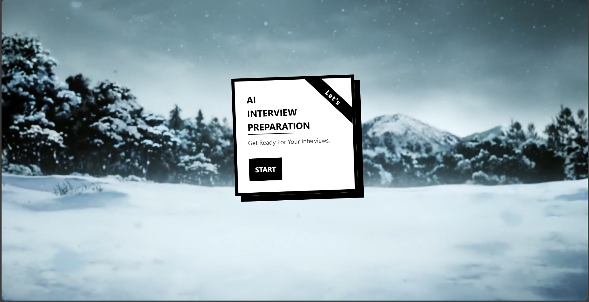

# 🤖 AI Interview Prep

An intelligent AI-powered platform to simulate real-world technical interviews with live feedback, voice interaction, and personalized suggestions — all in one place.


---

## 📌 Table of Contents

- [✨ Features](#-features)
- [📸 Demo](#-demo)
- [🚀 Tech Stack](#-tech-stack)
- [🛠️ Installation](#️-installation)
- [🧩 Folder Structure](#-folder-structure)
- [🧠 How It Works](#-how-it-works)
- [📈 Roadmap](#-roadmap)
- [🧑‍💻 Contributing](#-contributing)
- [📄 License](#-license)

---

## ✨ Features

✅ AI-generated interview questions  
✅ Voice input with speech-to-text  
✅ Real-time AI feedback on answers  
✅ Google Gemini & OpenAI integrations  
✅ Authentication via Firebase  
✅ Customizable roles & topics  
✅ Clean UI with Tailwind + shadcn/ui  
✅ Deployed on Vercel for speed  

---

## 📸 Demo



🔗 **Live Demo:** [Interview_prep](https://aiinterviewprep-delta.vercel.app/)

---

## 🚀 Tech Stack

### 💻 Frontend
  
  
  
  
  

### 🔐 Authentication & AI
  
  
  

### ☁️ Deployment


---

## 🛠️ Installation

### 1. Clone the repository

```bash
git clone https://github.com/ibrahimjp/Ai_Interview_Prep.git
cd Ai_Interview_Prep


```
### 🔐 Environment Variables
 ```bash
 PORT=5000
MONGO_URI=your_mongodb_connection_string
JWT_SECRET=your_jwt_secret_key
STRIPE_SECRET_KEY=your_stripe_secret_key
FRONTEND_URL=http://localhost:5173
```